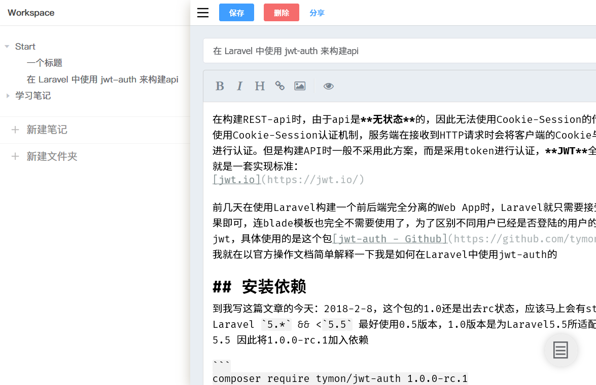
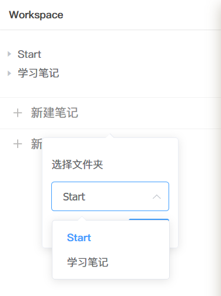
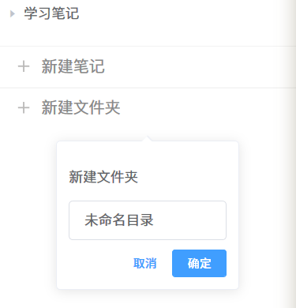
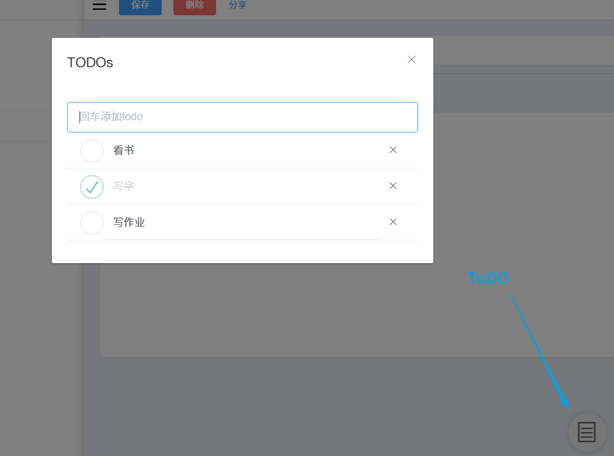
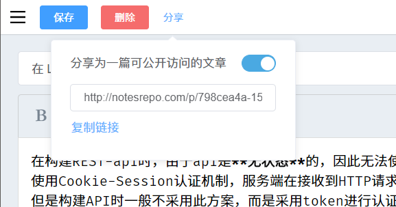
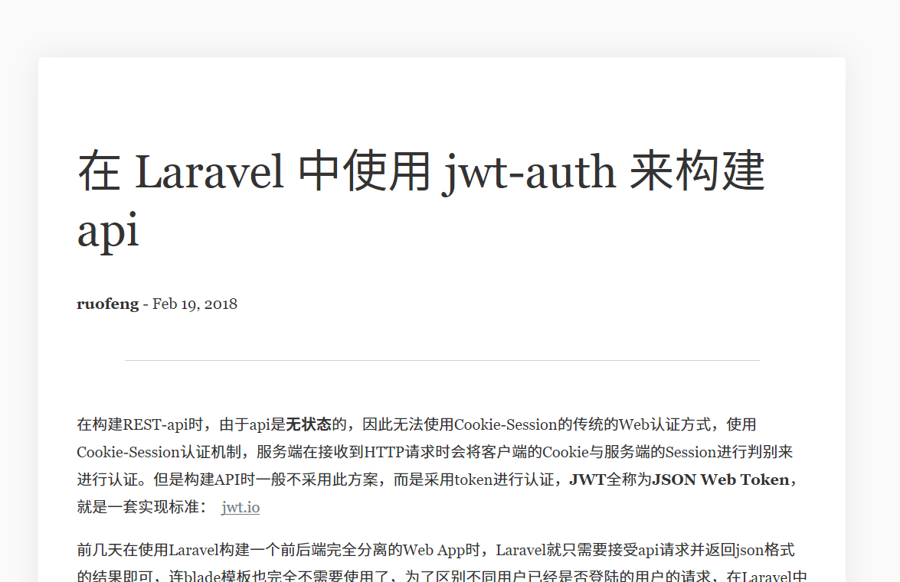

# NotesRepo

NotesRepo [http://notesrepo.com](http://notesrepo.com) 是一个使用 Larvel 5.5 开发，前端使用 VueJS 框架，使用 Element-UI 组件，前后端分离的一个个人笔记 Web 站点。此网站主要内容是`/workspace`这个单页面 web app ，是学习 Laravel 过程中第一个使用 vue 前后端分离开发的学习结果。

## 关于前端

由于并不是专注前端，VueJS 并没有学习的太深入，仅仅只是一个基本了解使用的情况，加上本 app 的前端逻辑也不是过于复杂，没有贯彻 Vue 渐进式、组件化开发的理念，只仅仅当作了一个写前端页面的工具，也没有使用 Vue 全家桶中的**路由 vue-routes**和**状态管理 vuex**，因此整个 Vue 实例都只是 Element-UI 的堆砌，模板与逻辑都写在了一整个`App.vue`文件中。

Makedown 编辑器使用的是[F-loat/vue-simplemde](https://github.com/F-loat/vue-simplemde)

## 关于后端

在后端 Web api 的开发中，api 认证使用的是 jwt 认证，使用了 laravel 的[tymondesigns/jwt-auth](https://github.com/tymondesigns/jwt-auth)这个包，在用于登陆表单操作时使用的传统的 Cookie Session 认证，以为跳转到**workspace**认证用户。在提交登陆表单时，同时也请求了 auth api 获取了一个 token 储存在浏览器的`localStorage`中，以为每次 api 请求储存认证信息，每次发送请求都会附带这个 api。

## [路由总览](https://github.com/abowloflrf/notesrepo/wiki/%E8%B7%AF%E7%94%B1)

## 一些预览

### Workspace 总览

### 新建笔记

### 新建文件夹

### TODO

### 发布笔记

### 成功发布的笔记

